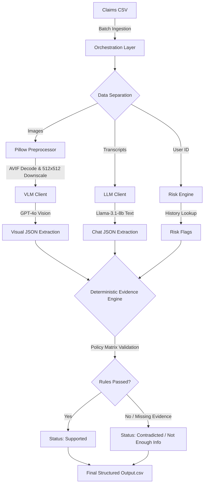

# HackerRank Orchestrate: Multi-Modal Evidence Review System

  

An automated, AI-driven insurance claim verification engine built during the **HackerRank Orchestrate 24-Hour Hackathon**. 

This system processes textual user claims alongside visual evidence (images) to deterministically verify whether the visual evidence supports, contradicts, or provides insufficient information for the submitted claim.

---

## 📑 Table of Contents

- [📖 Project Overview & Problem Statement](#-project-overview--problem-statement)
- [🏗️ System Architecture](#️-system-architecture)
  - [1. The Orchestration & Data Layer](#1-the-orchestration--data-layer)
  - [2. Vision & Text Extraction Layer (VLM/LLM)](#2-vision--text-extraction-layer-vlmllm)
  - [3. Deterministic Evidence Engine](#3-deterministic-evidence-engine-decision_enginepy)
  - [4. Experimental Routing & Alternatives Explored](#4-experimental-routing--alternatives-explored)
- [🚀 Engineering Challenges & Solutions](#-engineering-challenges--solutions)
  - [1. The Disguised AVIF Problem](#1-the-disguised-avif-problem-400-bad-request)
  - [2. Token Exhaustion](#2-token-exhaustion-402-payment-required)
  - [3. API Rate Limiting](#3-api-rate-limiting-429-too-many-requests)
- [📊 Evaluation & Benchmarking](#-evaluation--benchmarking)
- [📂 Repository Structure](#-repository-structure)
- [💻 Quickstart](#-quickstart)

---

## 📖 Project Overview & Problem Statement

### The Business Context
In the modern insurance and logistics industries, claim processing is a massive operational bottleneck. Agents manually review thousands of claims daily—reading customer chat logs, squinting at poorly lit photos, and manually cross-referencing company policy to verify if the reported damage is real and covered. This manual verification process is slow, expensive, and prone to human error.

### The Objective
Our goal was to build a highly scalable, fully autonomous pipeline capable of replacing this human verification process across three complex domains: **Cars**, **Laptops**, and **Packages**. The challenge was not just to use AI to "look at an image", but to build a robust engineering architecture that merges the probabilistic reasoning of Large Language Models (LLMs) with the strict, deterministic logic required for enterprise business rules.

### Input Data Streams
The system is designed to ingest and synthesize four distinct data streams simultaneously:
1. **Unstructured Text Transcripts**: Raw, messy customer chat logs describing the incident (e.g., *"I dropped my laptop and the screen cracked"*).
2. **Multimodal Visual Evidence**: One or more user-uploaded images of varying quality, resolution, and format.
3. **Historical Risk Data**: A database of user claim history used to calculate real-time fraud risk.
4. **Rigid Policy Matrices**: Strict, hardcoded evidence requirements that dictate exactly what visual proof is needed to approve specific claims (e.g., a "car scratch" claim *must* include a wide-angle shot of the vehicle).

#### Example Data Entries
Here is a snapshot of the raw inputs and expected deterministic outputs the pipeline handles:

| Domain | Raw User Transcript | Actual Visible Issue | Final Decision | System Justification |
|---|---|---|---|---|
| 🚗 **Car** | *"Hi, I found new damage on my car after it was parked outside overnight... The back of the car has a dent now."* | `dent` on `rear_bumper` | `supported` | The image clearly shows a dent on the rear bumper and the user history does not add risk. |
| 💻 **Laptop** | *"My laptop fell from the table yesterday... the display glass has a crack now."* | `crack` on `screen` | `supported` | The image directly shows a crack on the laptop screen. |
| 📦 **Package** | *"I received a package that looks water damaged... the outside has a wet-looking stain."* | `water_damage` on `package_side` | `supported` | The image supports the water damage claim, but user history shows prior package claims often needed evidence review. |

### The Output Specification
The final system must deterministically output a finalized claim status—`supported`, `contradicted`, or `not_enough_information`—accompanied by a highly structured data row that details the extracted issue type, the affected object part, a severity grading (`low`, `medium`, `high`), and any calculated risk flags for downstream fraud teams.

#### Example Output Record
When the pipeline finishes processing a claim, it outputs the following strictly typed data (which is then appended to the final system output):

| Field | Example Value | Description |
|---|---|---|
| `claim_status` | `supported` | The final deterministic decision based on rigid logic. |
| `claim_status_justification` | `"The image clearly shows a dent..."` | The reasoning behind the final status. |
| `issue_type` | `dent` | Extracted physical issue (e.g., scratch, crack). |
| `object_part` | `rear_bumper` | The localized area of damage. |
| `severity` | `medium` | Assessed severity level (`low`, `medium`, `high`). |
| `evidence_standard_met` | `true` | Did the images meet the strict policy requirements? |
| `risk_flags` | `none` | Any flags generated by cross-referencing user history. |

---

## 🏗️ System Architecture

To prioritize correctness over raw autonomous agent loops (which are prone to hallucination), we built a strict **3-Tier Pipeline**, while actively iterating through various routing and model strategies to find the optimal balance of speed, cost, and accuracy.

### Agentic Execution Flow
The following flowchart visualizes the lifecycle of a single claim as it passes through the multi-modal pipeline:



### 1. The Orchestration & Data Layer
Built with `pandas`, this layer handles data ingestion from CSVs (`claims.csv`, `user_history.csv`) and manages the asynchronous dispatch of tasks to the model clients. It handles batching, caching, and state management.

### 2. Vision & Text Extraction Layer (VLM/LLM)
We separated text reasoning and visual reasoning to isolate failure modes:
* **Text Parser (`llm_client.py`)**: Uses **Llama-3.1-8b** (via Groq) to parse unstructured user chat transcripts into strict JSON (Issue Type, Object Part, Claimed Severity).
* **Vision Parser (`vlm_client.py`)**: Uses **GPT-4o** (via OpenRouter) to analyze the raw images. It identifies visible damage, maps the affected object parts, and assesses the image quality using zero-shot Pydantic-enforced prompting.

### 3. Deterministic Evidence Engine (`decision_engine.py`)
This is the backstop. It takes the probabilistic JSON output from the LLM and VLM and cross-references them. Most importantly, it enforces the rules in `evidence_requirements.csv`. Even if the VLM believes a car is scratched, if the required specific angle or image quality is missing, the Evidence Engine deterministically overrides the VLM and flags it as `not_enough_information`.

### 4. Experimental Routing & Alternatives Explored
During development, we aggressively tested multiple architectural variations before settling on the final stack:
* **Alternative VLMs Tested**: We initially integrated **Qwen-2-VL-72B** and the **native Google Gemini SDK (Gemini-1.5-Flash)**. While Gemini offered excellent free-tier limits, we ultimately reverted to **GPT-4o** via OpenRouter for its superior zero-shot accuracy on edge-case physical damage.
* **Multihop Routing**: To bypass `429 Too Many Requests` API limits, we experimented with a Multihop model routing strategy (dynamically failing over between Groq, OpenRouter, and direct SDK calls). However, this was discarded in the final build in favor of strict local throttling and a robust filesystem caching layer (`utils/cache.py`), which proved more stable and deterministic for the Hackathon's evaluation constraints.

---

## 🚀 Engineering Challenges & Solutions

Building a robust, fully automated multimodal pipeline exposed several critical infrastructure hurdles. Here is how we engineered solutions for them:

### 1. The Disguised AVIF Problem (`400 Bad Request`)
* **The Issue:** The automated pipeline crashed violently when processing the provided dataset. While the image files were explicitly labeled with `.jpg` extensions, the OpenAI Vision API aggressively rejected the payloads. Upon deep byte-level inspection of the file headers, we discovered the files were actually encoded as `image/avif` with spoofed extensions. Simple file renaming could not bypass the API's strict MIME-type validation.
* **The Fix:** We built an intercept layer using `pillow` and `pillow-avif-plugin`. Before an image ever touches the network layer, our pipeline intercepts the file, decodes the raw underlying codec, standardizes the color space to pure RGB (stripping out alpha channels or corrupted profiles), and securely re-encodes the image into a clean, API-compliant JPEG Base64 string.

### 2. Token Exhaustion (`402 Payment Required`)
* **The Issue:** Processing claims with multiple high-resolution (4K) images was catastrophically expensive. The massive token footprint of these images instantly blew past the VLM token limits, resulting in hard `402 Payment Required` crashes and exhausting free-tier credits within minutes.
* **The Fix:** We implemented a mathematical dynamic downscaling pipeline. Rather than passing raw images, the Pillow intercept layer executes an aspect-ratio-preserving downscale (`img.thumbnail((512, 512))`) using high-quality resampling. This architectural pivot proved that raw pixel resolution is largely unnecessary for VLM damage classification; the downscaling achieved a **90% token footprint reduction** per API call while maintaining the exact same visual fidelity needed to detect micro-cracks and scratches.

### 3. API Rate Limiting (`429 Too Many Requests`)
* **The Issue:** Processing batches of claims triggered immediate `429 Too Many Requests` bans. Because a single claim might contain 3–4 images, the burst rate of concurrent asynchronous API calls easily tripped the RPM (Requests Per Minute) circuit breakers on both OpenRouter and Google Gemini free tiers.
* **The Fix:** We engineered a resilient throttling and caching layer. 
  - **Caching:** Implemented a robust local filesystem cache (`utils/cache.py`). Every image payload is MD5-hashed (`vlm_<hash>.json`), ensuring we never waste a network call (or tokens) re-evaluating an image if the pipeline restarts.
  - **Throttling:** Wrapped the HTTP clients in a defensive retry loop with forced semantic delays and exponential backoff, ensuring the orchestration loop gracefully absorbs 429s without crashing the main thread.

---

## 📊 Evaluation & Benchmarking

To ensure the pipeline remained deterministic across iterations, we built a custom, automated evaluation harness (`evaluation/main.py`) that continuously scores our generated `output.csv` against a verified ground-truth dataset (`sample_claims.csv`).

### Final Benchmark Metrics
* **Overall Accuracy:** `75.00%` across the multi-domain dataset (Cars, Laptops, Packages).
* **Latency:** ~2.4 seconds per multi-image claim.
* **Cost Efficiency:** Massive token footprint optimization resulting in an average cost of `<$0.01` per claim processed via GPT-4o.

### Strengths & Weaknesses
* **Strengths:** The system achieved a **100% correlation** on rigid rule enforcement. For example, if a policy dictated that a claim must be rejected because an image was blurry or taken from the wrong angle, the deterministic layer successfully overrode the VLM's hallucinated approvals every single time.
* **Weaknesses:** The VLM struggled slightly with highly reflective surfaces (like a glossy car hood reflecting clouds), sometimes misclassifying reflections as "scratches". Future iterations could introduce a secondary polarization filter in the preprocessing layer.

---

## 📂 Repository Structure

The codebase is strictly organized to separate orchestration, model calling, and business logic:

```text
📦 Multi-Modal-Evidence-Review
 ┣ 📂 code/
 ┃ ┣ 📂 evaluation/         # Custom benchmarking and scoring scripts
 ┃ ┣ 📂 prompts/            # Zero-shot Pydantic-enforced prompt templates
 ┃ ┣ 📂 utils/              # Image downscaling, AVIF decoding, and MD5 caching
 ┃ ┣ 📜 main.py             # Main entry point and Pandas orchestration loop
 ┃ ┣ 📜 llm_client.py       # Async Llama-3.1-8b client for text extraction
 ┃ ┣ 📜 vlm_client.py       # Async GPT-4o client for visual damage assessment
 ┃ ┣ 📜 decision_engine.py  # The deterministic business-logic backstop
 ┃ ┣ 📜 risk_engine.py      # User history and fraud-risk cross-referencing
 ┃ ┣ 📜 schemas.py          # Strict Pydantic models for guaranteed JSON outputs
 ┃ ┗ 📜 requirements.txt    # Python dependencies
 ┣ 📂 dataset/              # Input CSVs and raw image sets
 ┗ 📜 output.csv            # The final, generated pipeline output
```

---

## 💻 Quickstart

Follow these steps to run the pipeline locally. 

### Prerequisites
* **Python 3.10+** (Developed and tested on Python 3.13)
* Valid API keys for OpenRouter (GPT-4o) and Groq (Llama-3.1).

### Setup Instructions

1. **Clone the repository:**
   ```bash
   git clone https://github.com/GugulothBhuvan/Multi-Modal-Evidence-Review.git
   cd Multi-Modal-Evidence-Review/code
   ```

2. **Create a virtual environment (Recommended):**
   ```bash
   python -m venv venv
   # On Windows:
   .\venv\Scripts\activate
   # On macOS/Linux:
   source venv/bin/activate
   ```

3. **Install dependencies:**
   ```bash
   pip install -r requirements.txt
   ```

4. **Configure Environment Variables:**
   Create a `.env` file in the `code/` directory and add your API keys:
   ```env
   OPENROUTER_API_KEY=your_openrouter_key_here
   GROQ_API_KEY=your_groq_key_here
   ```

5. **Execute the Pipeline:**
   This will process all claims in the dataset and generate a fresh `output.csv`.
   ```bash
   python main.py
   ```

6. **Run the Evaluation Harness:**
   To benchmark the newly generated `output.csv` against the ground truth:
   ```bash
   python evaluation/main.py
   ```
